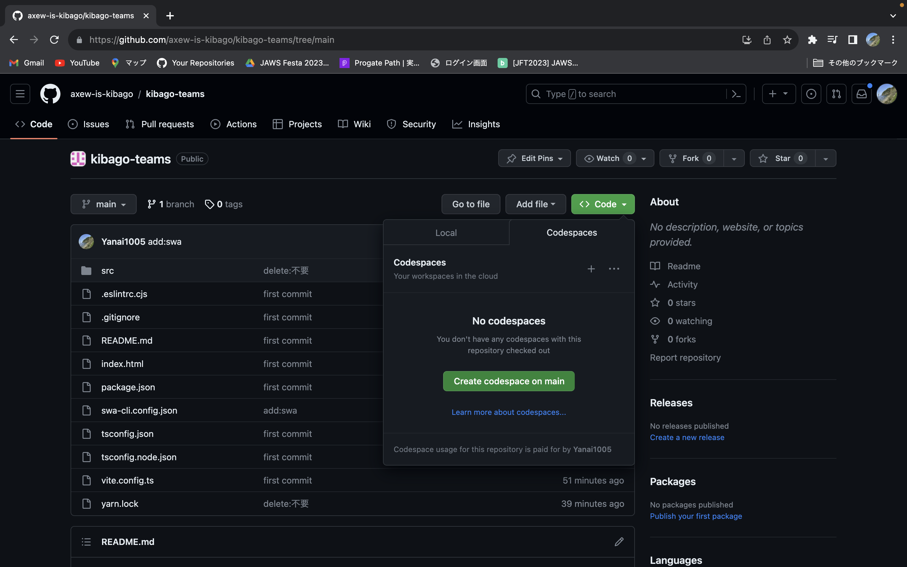

## 概要
## 使用技術
- React ( typescript )+vite
- Azure Static Web App
- Azure Functions(swa内包・nodejs typescript)
- Azure Database for MySQL
- Azure Data Studioで管理
## 環境構築
codespaceの場合  
    

[create codespace on main]をクリックで終了


### Function
api直下にSSL証明書と、DBの接続情報を持っておくためのlocal.settings.jsonが必要。

DBとの接続
api/local.settings.json
```json
{
  "IsEncrypted": false,
  "Values": {
    "FUNCTIONS_WORKER_RUNTIME": "node",
    "AzureWebJobsStorage": "UseDevelopmentStorage=true",
    "MYSQL_HOST":"",
    "MYSQL_USER":"",
    "MYSQL_PASSWORD":"",
    "MYSQL_DB":""
  }
}
```

```
yarn
swa start --api-location ./api
```

Functionのデバック
```
cd api
yarn
yarn start
```
or
```
cd api
yarn
yarn build
func start
```


yarn dev で開発サーバーを起動
```
yarn dev
```
functionsのトリガー変更したらapiディレクトリからyarn buildしないと、distに更新かからない。 ので、functionの内容変更したら、その都度yarn startし直す。  
補足  
詰まったら，参考見れば解決するかもです．  
参考  
https://learn.microsoft.com/ja-jp/azure/mysql/flexible-server/connect-nodejs?tabs=windows
https://aadojo.alterbooth.com/entry/2022/09/09/170000
### Azure Data Studio
下記のサイトを参考にしてください
https://learn.microsoft.com/ja-jp/sql/azure-data-studio/quickstart-mysql?view=sql-server-ver16

### Auth0
詰まったポイント 環境変数が誤ってクライアントに漏れてしまうことを防ぐために、VITE_ から始まる変数のみが Vite で処理されたコードに公開される． なので以下の.env設定は以下のようになる． https://zenn.dev/joo_hashi/scraps/1a44b946615d78 .envの設定
```
VITE_REACT_APP_AUTH0_DOMAIN=
VITE_REACT_APP_AUTH0_CLIENT_ID=
VITE_REACT_APP_AUTH0_REDIRECT_URI=
```
